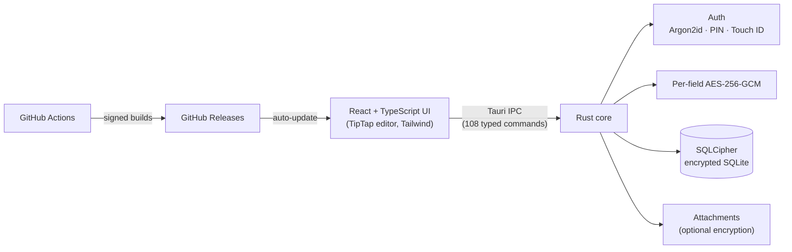

# DevNotebook

**An encrypted, local-first notebook for developers.** It keeps project secrets, credentials, setup guides, code snippets, and notes in one place on your machine, with no cloud and no account.


**[Download the latest release →](https://github.com/EMerdzhanov/DevNotebook/releases/latest)**

---

## Why it exists

Developers usually spread project knowledge across many places. API keys sit in `.env` files, setup steps live in a README nobody updates, and credentials end up in a password manager or Slack DMs. DevNotebook brings it together **per project**, encrypted at rest, in a fast desktop app.

## Features

**Projects and notes**
- A project dashboard with a home page for each project
- A rich-text note editor (Notion-style) with tables, code blocks, and file attachments
- Library entries for setup guides, workflows, checklists, code snippets, and reference docs, either global or linked to a project
- To-dos split into tasks and bugs, plus a daily journal
- Global search, a command palette, keyboard shortcuts, trash with undo, and four themes

**Secrets and credentials**
- Structured secrets (API keys, SSH keys, certificates, database connections) with view/edit modes and one-click copy
- A credentials overview across all projects
- Built-in TOTP (2FA) code generation and a password generator
- Export for the whole vault or for single items

**Security**
- Master password with **Argon2id** key derivation. The password is never stored.
- The whole database is encrypted with **SQLCipher**.
- Secrets are also encrypted per field with **AES-256-GCM** (defense in depth).
- Quick unlock with a PIN or **Touch ID** (macOS)
- Exponential backoff on failed unlock attempts
- Fully offline. Your data never leaves your machine.

**Distribution**
- Signed, cross-platform release builds (macOS Apple Silicon and Intel, Windows `.msi`/`.exe`)
- Automatic in-app updates

## Architecture



| Layer | Technology |
|---|---|
| Desktop shell | Tauri v2 |
| Backend | Rust: rusqlite with SQLCipher, argon2, aes-gcm, totp-rs |
| Frontend | React, TypeScript, Tailwind CSS, TipTap |
| CI/CD | GitHub Actions matrix (macOS arm64/x64, Windows), Tauri updater signing |

## How it was built

DevNotebook went from blank repo to a signed v0.1.0 release in **about three weeks** (May 26 to June 15, 2026). The process:

1. **Design spec first.** Scope, security model, data model, and UI layout were written down before any code ([`docs/superpowers/specs`](docs/superpowers/specs)).
2. **Implementation plans** for larger features ([`docs/superpowers/plans`](docs/superpowers/plans)).
3. **Iterative delivery** over 70+ commits, with QA and security-fix passes before release.
4. **Scope control.** A planned Bluetooth proximity-lock feature was cut before v1 in favor of PIN and Touch ID unlock, which were more reliable.
5. **Automated, repeatable releases.** A documented release runbook ([`.claude/commands/release.md`](.claude/commands/release.md)) drives version bump, tag, CI build, and draft release review.

The codebase is about 17,000 lines of Rust and TypeScript.

## Install

Download the installer for your platform from [Releases](https://github.com/EMerdzhanov/DevNotebook/releases/latest).

- **macOS:** use `.dmg` (`aarch64` for Apple Silicon, `x64` for Intel). The build is not notarized yet, so on first launch right-click the app and choose **Open**.
- **Windows:** use `.msi` or `-setup.exe`. If SmartScreen appears, choose **More info**, then **Run anyway**.

## Build from source

Requirements: Node.js 20+, Rust (stable), and the [Tauri v2 prerequisites](https://v2.tauri.app/start/prerequisites/). On Windows, OpenSSL is also needed (installed via vcpkg in CI).

```bash
npm install
npm run tauri dev     # run in development
npm run tauri build   # produce installers
```

## Roadmap

- QR-code pairing with a phone companion ([plan](docs/superpowers/plans))
- macOS notarization and Windows code signing

## Author

**Emil T. Merdzhanov** · [LinkedIn](https://www.linkedin.com/in/emil-t-merdzhanov/) · [GitHub](https://github.com/EMerdzhanov)

Other projects: [InfoMuck](https://infomuck.com) (AI regulatory intelligence) · [NPCTalk](https://npctalk.io) (AI social messenger)

---

© 2026 Emil T. Merdzhanov. All rights reserved.
